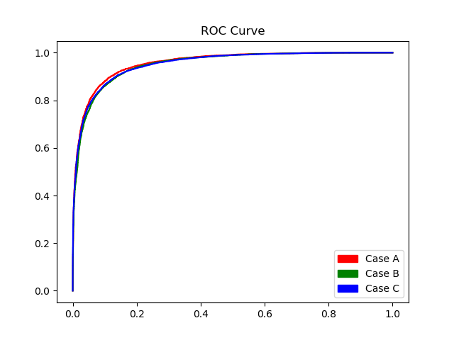

## Experiment with OMNIGLOT dataset

The goal of this experiment was to test how different affine transformations affect the training and testing of siamese neural networks.
This section contains Tensorflow implementation of this [paper](https://www.cs.cmu.edu/~rsalakhu/papers/oneshot1.pdf)

Four cases are covered: 
1. training and testing without transformations,
2. training and testing with transformations,
3. training without transformations and testing with transformations,
4. training with transformations and testing without transformations 

To train models with and without transformations, run **train.py**.

## Usage

To download the weights:
```
sh get_weights.sh
```

This will download pre-trained weights of models trained with and without affine transformations. 

## Results


